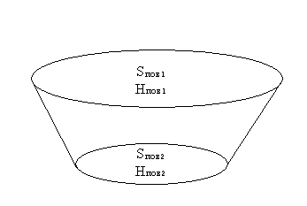
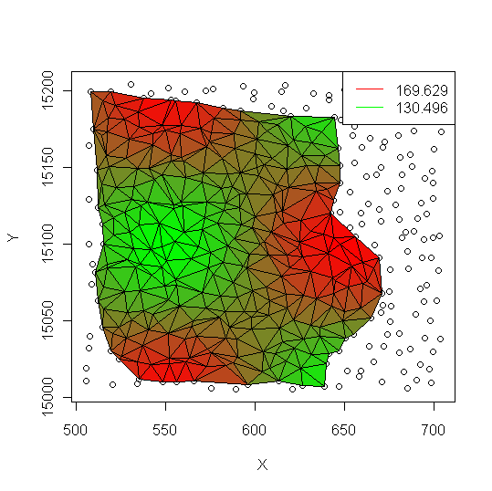
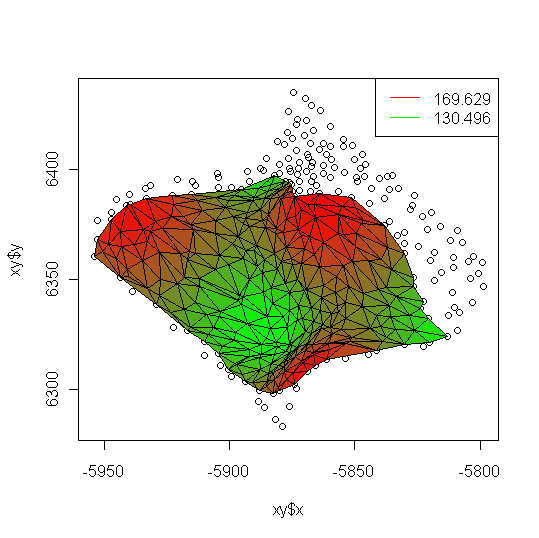

# CRAN.R GeoTer

## Description

Application of the package of statistical calculations R(CRAN) for solving geodetic problems for observing surfaces.

## About

All software products developed for processing surface observation results are expensive and proprietary. In addition, these software products do not provide the necessary detailing of the result, and in most cases these software products do not allow solving problems that are simple from a geometric point of view. That is, these products solve certain tasks, but do not allow, due to the opacity of these products, to vary the elements of these tasks. This, in turn, narrows the performance of these software products, and in certain cases makes them simply ineffective. This applies primarily to products such as CREDO_TER. This software product produces such an exaggerated result that it is impossible to be sure of its reliability or to modify this result.

This project will show not only the level of technologies distributed under the GPL license, but also their incredible transparency and completeness of the presented result.

The author of this technique wishes to present to the readers a software product distributed under the GPL license, and called R (CRAN). This software product is a statistical calculation system with a very convenient presentation of data in the form of lists and tables.

## Theoretical foundations of surface observation processing tasks.

The tasks of processing the results of observations of surfaces are aimed at obtaining for any surfaces, no matter how complex they are, certain general characteristics. Such characteristics include the surface level (Hпов), the level surface area (Sпов), the elements of the average surface slope [ipov, a (ipov)], surface curvature (jпов), the maximum surface slope (imax).

The above characteristics of surfaces are only necessary for large-scale tasks related to surfaces in general. These characteristics have an impact on all smaller tasks.

Most often, these characteristics are required to calculate the volume of soil (Vgr) enclosed between two surfaces. In this case, surfaces are usually represented by different sets of points observed in different periods of time.

The calculation scheme in this case looks like this.


```
Vgr = 1/3 * [S1 + S2 + sqrt(S1*S2)] * (H1 - H2)
```

As you can see, having general characteristics of surfaces, the task of calculating the volume of soil is immediately solved by one simple formula and is not difficult.

The tricky part here is getting general characteristics for complex surfaces. And the next chapter will be devoted to this.

### Obtaining general characteristics of surfaces (Spov, Нpov).

A surface defined by sets of points can also be represented by a set of non-intersecting triangles. Constructing a given set of triangles is called triangulation. Delaunay triangulation is a widespread and widely used method of triangulation. This triangulation follows a set of specific geometric rules and reflects well the triangulated surface. The triangulation algorithm will not be considered in this article, I will only mention that I use an incremental algorithm from a given boundary with quick sort.

After the triangulation is made (the points are combined into triangles), for each triangle, you can find the area and level of its center:
```
St = 1/2 * |(x1+x2)*(y1-y2)+(x2+x3)*(y2-y3)+(x3+x1)*(y3-y1)|
Ht = 1/3 * (H1+H2+H3)
```

Having received the areas and levels of all triangles, you can get the area and level of the entire surface:
```
Spov = sum(St)
Hpov = sum(St*Ht) / Spov
```

If you carry out similar calculations for two surfaces related to the same object, you can safely solve the problem posed in the previous chapter.

## Application of the R package (CRAN) to obtain general surface parameters.

To obtain the general parameters of surfaces and their visualization, the author of this manual has typed a set of functions in the R language. The listings of these functions are presented in the appendix of this manual. This chapter will only explain their purpose. The functions are split into two libraries:
```
ahull2d.r    - computational geometry functions
geo_ter.r    - geodata processing functions
```

To work with these functions, you need to place them in a folder ("C:\R\geoter\R", for example), start the R program and type the following commands in its console:
```
setwd("C:/R/geoter/R")
getwd()
dir()
source("ahull2d.r")
source("geo_ter.r")
```

Next, set the working folder with data, which can be a text file with numbers separated by a space, or a csv file (numbers are separated by a semicolon). For example:
```
setwd("C:/R/geoter/data")
getwd()
dir()
```

Depending on how the data is presented, we use the appropriate command:
```
nxyz<-read.table("test.nxyz.txt")
nxyz<-read.csv("test.nxyz.csv")
names(nxyz)<-c("N","X","Y","Z")
nxyz
```

We split the table for the convenience of working with data:
```
x<-nxyz$X
y<-nxyz$Y
z<-nxyz$Z
```

For a convex hull, we define the boundary:
```
gr<-convexhull2d(x,y)
```

For data with a certain boundary, the boundary points are either placed at the beginning of the data file in counterclockwise traversal order, then:
```
gr<-seq(n)
gr
```
where n is the number of points in the border, or we specify them directly:
```
gr<-c(N1,N2,...,Nk)
```
where N1, N2, ..., Nk are the numbers of points in the general list.

Having decided on the boundary, we make a triangulation:
```
tri<-delaunay2d(x,y,gr)
tri
```

Having decided on the surface structure, we determine its characteristics:
```
povSZ<-tri.area.fast(tri,x,y,z)
povSZ
```

And, of course, some graphics
```
tri.plot.2d(tri,x,y,z)
```

```
tri.plot.3d(tri,x,y,z)
```


We save the result, compose the count. And that's all.

## Links.

* http://www.R-project.org

----

«And there will be no darkness after us...»

A.N. Karetin.

30.06.2011г.
